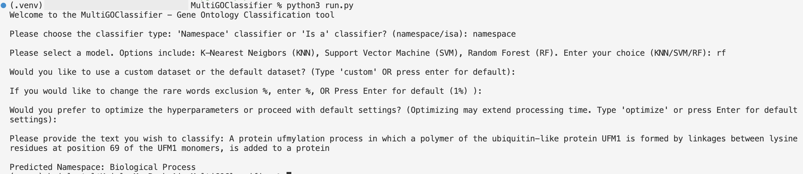

# MultiGOClassifier - Gene Ontology Classification tool

### Overview

**MultiGOClassifier** is a tool designed to classify biological literature text into specific Gene Ontology (GO) categories. It supports two types of classifications:

* **Namespace Classification**: A multiclass classification that assigns the text to one of the GO namespaces.
* **"Is A" Classification**: A multilabel classification that categorizes the text based on "is a" relation categories within the GO hierarchy.

This tool is particularly useful for researchers and bioinformaticians involved in gene ontology annotations.

### Project Structure
```
.
├── Readme.md
├── dataset
│   └── go-basic.obo
├── experiments
│   ├── multigoclassfier_multiclass.ipynb
│   ├── multigoclassfier_multilabel_10.ipynb
│   └── multigoclassfier_multilabel_20.ipynb
├── multigoclassfier_tool
│   ├── is_a_classifier
│   │   ├── __init__.py
│   │   ├── is_a_classifier.py
│   │   └── models
│   │       ├── __init__.py
│   │       ├── random_forest.py
│   │       └── svm.py
│   └── namespace_classifier
│       ├── __init__.py
│       ├── models
│       │   ├── __init__.py
│       │   ├── namespace_knn.py
│       │   ├── namespace_random_forest.py
│       │   └── namespace_svm.py
│       └── namespace_classifier.py
├── images
│   ├── KNN1.png
│   ├── SVM1.png
│   ├── example.png
│   └── piechart.png
├── requirements.txt
└── run.py

```

### Installation

1. Create a virtual environment with the command

    `python -m venv .venv`

2. Activate the virtual environment

    `source .venv/bin/activate`

3. Install Dependencies using 

    `pip install -r requirements.txt`

4. Download dataset using the command 

    `curl https://current.geneontology.org/ontology/go-basic.obo > dataset/go-basic.obo`

### Usage

After installing the necessary dependencies, you can use the tool by running the run.py file using the below command.

`python3 run.py`

 The script will prompt you for various inputs via the command line and then provide the classification results.

**Example**


